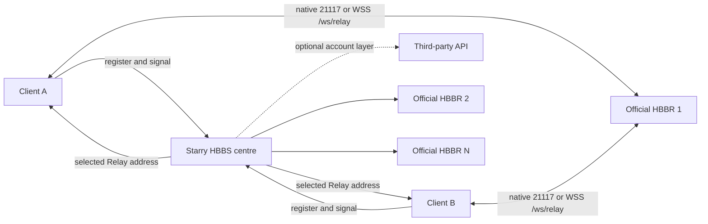

# Multi-node deployment

**English** | [简体中文](https://github.com/q1ngyang/rustdesk-server-starry/wiki/ZH-CN-Multi-Node-Deployment)

Use this topology when one Starry HBBS centre must allocate several official
HBBR nodes. An account/API service is optional and remains independent.

## Architecture



HBBS chooses a Relay; HBBR carries the session. The API does neither.

## Public names and ports

Example-only names:

| Role | Name | Public paths |
| --- | --- | --- |
| Centre HBBS | `id.example.com` | `21116/TCP+UDP`; optional `wss://id.example.com/ws/id` |
| API | `api.example.com` | optional HTTPS `443/TCP` |
| Relay 1 | `relay-1.example.com` | `21117/TCP`; optional `wss://relay-1.example.com/ws/relay` |
| Relay 2 | `relay-2.example.com` | same |

Every WSS URL must use a hostname covered by its certificate. Do not replace a
failed certificate-matching name with an IP or disable verification.

## Key model

- The centre generates `id_ed25519` and `id_ed25519.pub`.
- The private key stays only in the protected centre data and its backups.
- Clients receive the public-key content.
- Relay-only nodes receive only that same public key through the official HBBR
  `KEY` setting.
- A community API that needs the server identity mounts only
  `id_ed25519.pub`, read-only.

Never copy the centre private key to every Relay.

## Stage 1: bootstrap the centre

Use:

- [`examples/center/compose.bootstrap.yaml`](https://github.com/q1ngyang/rustdesk-server-starry/blob/main/examples/center/compose.bootstrap.yaml)
- [`examples/center/.env.example`](https://github.com/q1ngyang/rustdesk-server-starry/blob/main/examples/center/.env.example)

```sh
cd /opt/rustdesk-center
cp /path/to/repository/examples/center/.env.example .env
cp /path/to/repository/examples/center/compose.bootstrap.yaml .
mkdir -p data/server data/api

docker compose --env-file .env -f compose.bootstrap.yaml config --quiet
docker compose --env-file .env -f compose.bootstrap.yaml up -d
test -s data/server/id_ed25519
test -s data/server/id_ed25519.pub
```

Back up the identity before continuing. Confirm a basic native client
registration against this HBBS.

## Stage 2: prepare Starry Relay configuration

Start from `config.geo-basic.yaml` or `config.websocket.yaml`. The complete
candidate pool belongs in `relay_servers`:

```yaml
relay_servers:
  - relay-1.example.com:21117
  - relay-2.example.com:21117
```

Every Geo rule may reference only entries in that pool. Rule order and each
rule's Relay order are strict priority, not round-robin.

If WebSocket Signal is enabled, `relay_health.endpoints` must cover this pool
exactly:

```yaml
websocket_signal:
  enabled: true
  relay_health:
    endpoints:
      - relay: relay-1.example.com:21117
        url: wss://relay-1.example.com/ws/relay
      - relay: relay-2.example.com:21117
        url: wss://relay-2.example.com/ws/relay
```

Do not enable it until both exact paths return a valid TLS/WebSocket Upgrade
and the real client acceptance path is ready.

## Stage 3: deploy each Relay-only node

Use:

- [`examples/relay/compose.yaml`](https://github.com/q1ngyang/rustdesk-server-starry/blob/main/examples/relay/compose.yaml)
- [`examples/relay/.env.example`](https://github.com/q1ngyang/rustdesk-server-starry/blob/main/examples/relay/.env.example)

On each Relay:

```sh
mkdir -p /opt/rustdesk-relay/data
cd /opt/rustdesk-relay
cp /path/to/repository/examples/relay/compose.yaml .
cp /path/to/repository/examples/relay/.env.example .env
```

Paste the one-line centre public key into `RUSTDESK_PUBLIC_KEY`. Then:

```sh
docker compose --env-file .env -f compose.yaml config --quiet
docker compose --env-file .env -f compose.yaml up -d
docker compose --env-file .env -f compose.yaml logs --tail 100 hbbr
```

The optional Relay tuning values in this example belong to official HBBR
1.1.16, not to the Starry overlay:

| Environment variable | Example | Unit and effect |
| --- | ---: | --- |
| `RELAY_SINGLE_BANDWIDTH` | `128` | Mb/s cap for one Relay session |
| `RELAY_TOTAL_BANDWIDTH` | `1024` | Mb/s aggregate cap for the HBBR process |
| `RELAY_LIMIT_SPEED` | `32` | Mb/s cap after a session is downgraded |
| `RELAY_DOWNGRADE_START_CHECK` | `1800` | Seconds before downgrade eligibility |
| `RELAY_DOWNGRADE_THRESHOLD` | `0.66` | Average-use fraction of the single-session cap that triggers downgrade eligibility |

These are explicit example limits. Size them for the node and verify the
effective values in HBBR startup logs.

Open `21117/TCP`. When WebSocket is required, install a certificate-valid
Nginx `/ws/relay` and expose `443/TCP`; keep backend `21119/TCP` private.

## Stage 4: switch the centre to the full stack

Use [`examples/center/compose.yaml`](https://github.com/q1ngyang/rustdesk-server-starry/blob/main/examples/center/compose.yaml)
in the **same** Compose project and data paths as the bootstrap file:

```sh
cp /path/to/repository/examples/center/compose.yaml .
docker compose --env-file .env -f compose.bootstrap.yaml down
docker compose --env-file .env -f compose.yaml config --quiet
docker compose --env-file .env -f compose.yaml up -d
```

Do not leave the bootstrap HBBS and full-stack HBBS running as two projects.

The full reference includes one community API implementation to show the
integration boundary. It is not maintained or endorsed by Starry. Before use:

- review the independent
  [`liyan-lucky/rustdesk-api-server-pro`](https://github.com/liyan-lucky/rustdesk-api-server-pro)
  repository, licence, releases, and open security issues;
- replace its `latest` example with a reviewed immutable tag or digest when
  the provider makes one available;
- copy `examples/center/server.yaml.example` to `server.yaml`, set file mode
  `0600`, and replace `signKey` plus the initial administrator password;
- restrict its backend port to loopback;
- keep its persistent data and upgrades independent; and
- mount only the HBBS public key.

On first boot, when no persistent runtime config exists, the provider's startup
script copies `/app/server.yaml` to `/app/data/server.yaml`. Later starts do not
overwrite the persistent copy. Complete this before starting the API:

```sh
cp /path/to/repository/examples/center/server.yaml.example server.yaml
chmod 600 server.yaml .env
mkdir -p data/api
```

The reference `ADMIN_USER` and `ADMIN_PASS` values are first-boot inputs for
that independent image. Replace them before the first start and follow the
provider's current configuration, rotation, and upgrade documentation
afterward; do not expect later edits to the source `server.yaml` to overwrite
`data/api/server.yaml`.

Remove the API service when account features are not needed.

## Stage 5: deploy Nginx

- Centre WSS: [`center.example.conf`](https://github.com/q1ngyang/rustdesk-server-starry/blob/main/examples/nginx/center.example.conf)
- API: [`api.example.conf`](https://github.com/q1ngyang/rustdesk-server-starry/blob/main/examples/nginx/api.example.conf)
- Every Relay: [`relay.example.conf`](https://github.com/q1ngyang/rustdesk-server-starry/blob/main/examples/nginx/relay.example.conf)

See [Reverse Proxy and TLS](https://github.com/q1ngyang/rustdesk-server-starry/wiki/Reverse-Proxy-and-TLS)
before enabling WebSocket Signal.

## Verification order

1. Every Relay HBBR process is running and its public port is reachable.
2. Centre `relay-servers` lists the expected allocation pool after the official
   health refresh interval.
3. `test-geo` returns the intended first online Relay for representative IP
   pairs.
4. Disable one priority Relay and prove ordered failover, then restore it.
5. When WSS is enabled, `websocket-status` shows the correct per-Relay native
   and WSS state.
6. Complete native, WSS, and mixed real-client sessions and correlate the same
   Relay UUID in the evidence.
7. Test API login separately, then repeat Secure TCP and remote control while
   logged in.

An HBBS-to-HBBR reachability result is not client-to-Relay latency or packet
loss. Do not market centre ping as endpoint path quality.
