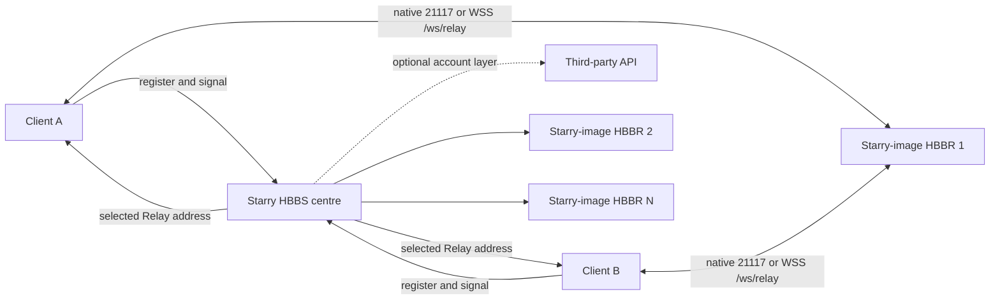

# Multi-node deployment

**English** | [简体中文](https://github.com/q1ngyang/rustdesk-server-starry/wiki/ZH-CN-Multi-Node-Deployment)

Use this topology when one Starry HBBS centre must allocate several HBBR
nodes. Each HBBS and HBBR uses the same pinned Starry image tag. HBBR preserves
upstream forwarding and adds a public probe plus authenticated telemetry; version locking avoids problems
caused by independent image updates. An account/API service is optional and
remains independent.

## Architecture



HBBS chooses a Relay; HBBR carries the session. The API does neither.

## Public names and ports

Example-only names:

| Role | Name | Public paths |
| --- | --- | --- |
| Centre HBBS | `id.example.com` | `21116/TCP+UDP`; optional `wss://id.example.com/ws/id` |
| API | `api.example.com` | optional HTTPS `443/TCP` |
| Relay 1 | `relay-1.example.com` | `21117/TCP`; optional `wss://relay-1.example.com/ws/relay` |
| Relay 2 | `relay-2.example.com` | same |

Every WSS URL must use a hostname covered by its certificate. Do not replace a
failed certificate-matching name with an IP or disable verification.

## Key model

- The centre generates `id_ed25519` and `id_ed25519.pub`.
- The private key stays only in the protected centre data and its backups.
- Clients receive the public-key content.
- Relay-only nodes receive only that same public key through the HBBR `KEY`
  setting.
- A community API that needs the server identity mounts only
  `id_ed25519.pub`, read-only.

Never copy the centre private key to every Relay.

## Stage 1: bootstrap the centre

Use:

- [`examples/center/compose.bootstrap.yaml`](https://github.com/q1ngyang/rustdesk-server-starry/blob/main/examples/center/compose.bootstrap.yaml)
- [`examples/center/.env.example`](https://github.com/q1ngyang/rustdesk-server-starry/blob/main/examples/center/.env.example)

```sh
cd /opt/rustdesk-center
cp /path/to/repository/examples/center/.env.example .env
cp /path/to/repository/examples/center/compose.bootstrap.yaml .
mkdir -p data/server

docker compose --env-file .env -f compose.bootstrap.yaml config --quiet
docker compose --env-file .env -f compose.bootstrap.yaml up -d
test -s data/server/id_ed25519
test -s data/server/id_ed25519.pub
```

Back up the identity before continuing. Confirm a basic native client
registration against this HBBS.

## Stage 2: prepare Starry Relay configuration

Start from `config.geo-basic.yaml` or `config.websocket.yaml`. The complete
candidate pool belongs in `relay_servers`:

```yaml
relay_servers:
  - relay-1.example.com:21117
  - relay-2.example.com:21117
```

Every Geo rule may reference only entries in that pool. Rule order and each
rule's Relay order are strict priority, not round-robin.

If WebSocket Signal is enabled, `relay_health.endpoints` must cover this pool
exactly:

```yaml
websocket_signal:
  enabled: true
  relay_health:
    endpoints:
      - relay: relay-1.example.com:21117
        url: wss://relay-1.example.com/ws/relay
      - relay: relay-2.example.com:21117
        url: wss://relay-2.example.com/ws/relay
```

Do not enable it until both exact paths return a valid TLS/WebSocket Upgrade
and the real client acceptance path is ready.

## Stage 3: deploy each Relay-only node

Use:

- [`examples/relay/compose.yaml`](https://github.com/q1ngyang/rustdesk-server-starry/blob/main/examples/relay/compose.yaml)
- [`examples/relay/.env.example`](https://github.com/q1ngyang/rustdesk-server-starry/blob/main/examples/relay/.env.example)

On each Relay:

```sh
mkdir -p /opt/rustdesk-relay/data
cd /opt/rustdesk-relay
cp /path/to/repository/examples/relay/compose.yaml .
cp /path/to/repository/examples/relay/.env.example .env
```

Paste the one-line centre public key into `RUSTDESK_PUBLIC_KEY`. Then:

```sh
docker compose --env-file .env -f compose.yaml config --quiet
docker compose --env-file .env -f compose.yaml up -d
docker compose --env-file .env -f compose.yaml logs --tail 100 hbbr
```

The Relay tuning values belong to HBBR in the pinned Starry image. Capacity
values also feed the authenticated load snapshot pulled by HBBS for quality scoring:

| Environment variable | Example | Unit and effect |
| --- | ---: | --- |
| `RELAY_SINGLE_BANDWIDTH` | `128` | Mb/s cap for one Relay session |
| `RELAY_TOTAL_BANDWIDTH` | `1024` | Mb/s aggregate cap for the HBBR process |
| `RELAY_MAX_SESSIONS` | `10000` | Enforced paired-session admission limit; existing sessions survive capacity/drain changes |
| `RELAY_PROBE_PER_IP_PER_MINUTE` | `120` | Public probe budget per transport source IP |
| `RELAY_PROBE_GLOBAL_PER_MINUTE` | `10000` | Process-wide public probe budget |
| `RELAY_DRAINING_FILE` | `/root/starry/hbbr.draining` | Existing file closes admission without ending active sessions |
| `RELAY_LIMIT_SPEED` | `32` | Mb/s cap after a session is downgraded |
| `RELAY_DOWNGRADE_START_CHECK` | `1800` | Seconds before downgrade eligibility |
| `RELAY_DOWNGRADE_THRESHOLD` | `0.66` | Average-use fraction of the single-session cap that triggers downgrade eligibility |

These are explicit example limits. Size them for the node and verify the
effective values in HBBR startup logs.

Open `21117/TCP`. When WebSocket is required, install a certificate-valid
Nginx `/ws/relay` and expose `443/TCP`; keep backend `21119/TCP` private.

Before enabling Relay Quality, create the same random 32-byte-or-longer secret
file in the HBBS and HBBR containers (for the examples, a convenient path is
`/root/starry/relay-telemetry.secret`, backed by each node's private data
directory). Set only that container path in `RELAY_TELEMETRY_SECRET_FILE` and
in HBBS `telemetry_secret_file`; never place the value in `.env` or YAML.
Change each quality endpoint to the internal
`wss://relay-N.../ws/telemetry` path. Restrict that path to HBBS source networks
and prefer mTLS at the proxy. The public `/ws/relay` path remains unchanged and
never exposes detailed load. See
[Relay Telemetry Security and Operations](../Relay-Telemetry-Operations.md).

## Stage 4: switch the centre to the full stack

Use [`examples/center/compose.yaml`](https://github.com/q1ngyang/rustdesk-server-starry/blob/main/examples/center/compose.yaml)
in the **same** Compose project and data paths as the bootstrap file:

```sh
cp /path/to/repository/examples/center/compose.yaml .
docker compose --env-file .env -f compose.bootstrap.yaml down
docker compose --env-file .env -f compose.yaml config --quiet
docker compose --env-file .env -f compose.yaml up -d
```

Do not leave the bootstrap HBBS and full-stack HBBS running as two projects.

The full Starry reference intentionally contains only the HBBS/HBBR data
plane. A compatible third-party API can be added separately; the recommended
implementation is
[`q1ngyang/rustdesk-api-kessoku`](https://github.com/q1ngyang/rustdesk-api-kessoku).
Follow the [Kessoku Wiki](https://github.com/q1ngyang/rustdesk-api-kessoku/wiki)
for its current version and deployment requirements. The dedicated joint
deployment page is still in preparation and will be linked from
[Account/API Integration](https://github.com/q1ngyang/rustdesk-server-starry/wiki/API-Integration).
Do not mount Starry private keys into an API container.

## Stage 5: deploy Nginx

- Centre WSS: [`center.example.conf`](https://github.com/q1ngyang/rustdesk-server-starry/blob/main/examples/nginx/center.example.conf)
- Every Relay: [`relay.example.conf`](https://github.com/q1ngyang/rustdesk-server-starry/blob/main/examples/nginx/relay.example.conf)

The generic API example is not a Kessoku proxy contract. Follow the API
project's own Wiki for its public and internal listeners.

See [Reverse Proxy and TLS](https://github.com/q1ngyang/rustdesk-server-starry/wiki/Reverse-Proxy-and-TLS)
before enabling WebSocket Signal.

## Verification order

1. Every Relay HBBR process is running and its public port is reachable.
2. Centre `relay-servers` lists the expected allocation pool after the health
   refresh interval.
3. `test-geo` returns the intended first online Relay for representative IP
   pairs.
4. Disable one priority Relay and prove ordered failover, then restore it.
5. When WSS is enabled, `websocket-status` shows the correct per-Relay native
   and WSS state.
6. Complete native, WSS, and mixed real-client sessions and correlate the same
   Relay UUID in the evidence.
7. Test API login separately, then repeat Secure TCP and remote control while
   logged in.

An HBBS-to-HBBR reachability result is not client-to-Relay latency or packet
loss. Do not market centre ping as endpoint path quality.

If the deployment has more than one HBBS centre, Profile Activation Leases are
strictly node-local. Akari registers with each centre and stores the returned
lease/generation by server instance; Kessoku verifies and deactivates against
the issuing instance only. Never copy a lease between centres. See
[Profile Activation Lease v1](../../reference/PROFILE-ACTIVATION-LEASE-v1.md).
