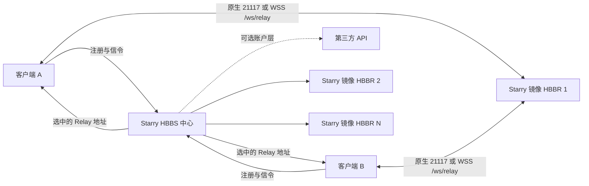

# 多节点部署

[English](https://github.com/q1ngyang/rustdesk-server-starry/wiki/Multi-Node-Deployment) | **简体中文**

当一个 Starry HBBS 中心需要分配多台 HBBR 时使用此结构。所有 HBBS 与 HBBR 都使用
同一个固定版本的 Starry 镜像。HBBR 本身仍是未经修改的上游代码，但统一镜像版本可
避免两个服务分别更新造成兼容问题。账户/API 服务为可选独立组件。

## 架构



HBBS 选择 Relay；HBBR 转发会话；API 两者都不负责。

## 公网名称与端口

仅用于示例的名称：

| 角色 | 名称 | 公网路径 |
| --- | --- | --- |
| 中心 HBBS | `id.example.com` | `21116/TCP+UDP`；可选 `wss://id.example.com/ws/id` |
| API | `api.example.com` | 可选 HTTPS `443/TCP` |
| Relay 1 | `relay-1.example.com` | `21117/TCP`；可选 `wss://relay-1.example.com/ws/relay` |
| Relay 2 | `relay-2.example.com` | 同上 |

每个 WSS URL 必须使用证书覆盖的域名。不要在证书域名失败后改用 IP 或关闭验证。

## 密钥模型

- 中心生成 `id_ed25519` 和 `id_ed25519.pub`。
- 私钥只保留在受保护中心数据和备份中。
- 客户端配置公钥内容。
- 纯中继节点只通过 HBBR 的 `KEY` 设置获得相同公钥。
- 需要服务器身份的社区 API 只读挂载 `id_ed25519.pub`。

不要把中心私钥复制到每台 Relay。

## 阶段 1：引导中心

使用：

- [`examples/center/compose.bootstrap.yaml`](https://github.com/q1ngyang/rustdesk-server-starry/blob/main/examples/center/compose.bootstrap.yaml)
- [`examples/center/.env.example`](https://github.com/q1ngyang/rustdesk-server-starry/blob/main/examples/center/.env.example)

```sh
cd /opt/rustdesk-center
cp /path/to/repository/examples/center/.env.example .env
cp /path/to/repository/examples/center/compose.bootstrap.yaml .
mkdir -p data/server

docker compose --env-file .env -f compose.bootstrap.yaml config --quiet
docker compose --env-file .env -f compose.bootstrap.yaml up -d
test -s data/server/id_ed25519
test -s data/server/id_ed25519.pub
```

继续之前先备份身份，并确认客户端能进行一次基础原生 HBBS 注册。

## 阶段 2：准备 Starry 中继服务器配置

从 `config.geo-basic.yaml` 或 `config.websocket.yaml` 开始。完整候选池写入
`relay_servers`：

```yaml
relay_servers:
  - relay-1.example.com:21117
  - relay-2.example.com:21117
```

每条地理位置规则只能引用该列表中的条目。规则顺序和规则内的中继服务器顺序都是严格
优先级，不会轮询。

启用 WebSocket Signal 时，`relay_health.endpoints` 必须精确覆盖该池：

```yaml
websocket_signal:
  enabled: true
  relay_health:
    endpoints:
      - relay: relay-1.example.com:21117
        url: wss://relay-1.example.com/ws/relay
      - relay: relay-2.example.com:21117
        url: wss://relay-2.example.com/ws/relay
```

两条精确路径都通过有效 TLS/WebSocket Upgrade，且真实客户端验收已准备好之前不要启用。

## 阶段 3：部署每台纯中继节点

使用：

- [`examples/relay/compose.yaml`](https://github.com/q1ngyang/rustdesk-server-starry/blob/main/examples/relay/compose.yaml)
- [`examples/relay/.env.example`](https://github.com/q1ngyang/rustdesk-server-starry/blob/main/examples/relay/.env.example)

每台中继节点执行：

```sh
mkdir -p /opt/rustdesk-relay/data
cd /opt/rustdesk-relay
cp /path/to/repository/examples/relay/compose.yaml .
cp /path/to/repository/examples/relay/.env.example .env
```

把中心公钥单行内容填入 `RUSTDESK_PUBLIC_KEY`，然后：

```sh
docker compose --env-file .env -f compose.yaml config --quiet
docker compose --env-file .env -f compose.yaml up -d
docker compose --env-file .env -f compose.yaml logs --tail 100 hbbr
```

这些可选带宽设置属于固定版本 Starry 镜像内的上游 HBBR 数据路径，不属于 Starry 的
HBBS 扩展层或版本响应头：

| 环境变量 | 示例值 | 单位与作用 |
| --- | ---: | --- |
| `RELAY_SINGLE_BANDWIDTH` | `128` | 单个中继会话上限，单位 Mb/s |
| `RELAY_TOTAL_BANDWIDTH` | `1024` | HBBR 进程总带宽上限，单位 Mb/s |
| `RELAY_LIMIT_SPEED` | `32` | 会话被降速后的上限，单位 Mb/s |
| `RELAY_DOWNGRADE_START_CHECK` | `1800` | 会话进入降速判定前的秒数 |
| `RELAY_DOWNGRADE_THRESHOLD` | `0.66` | 以单会话上限为基准、触发降速资格的平均用量比例 |

这些是示例显式限值。请按节点容量调整，并从 HBBR 启动日志确认实际生效值。

对公网开放 `21117/TCP`。需要 WebSocket 时配置证书有效的 Nginx `/ws/relay` 并开放
`443/TCP`，后端 `21119/TCP` 保持私有。

## 阶段 4：中心切换到完整栈

在与引导文件**相同** Compose project 和数据路径中使用
[`examples/center/compose.yaml`](https://github.com/q1ngyang/rustdesk-server-starry/blob/main/examples/center/compose.yaml)：

```sh
cp /path/to/repository/examples/center/compose.yaml .
docker compose --env-file .env -f compose.bootstrap.yaml down
docker compose --env-file .env -f compose.yaml config --quiet
docker compose --env-file .env -f compose.yaml up -d
```

不要让初始化 HBBS 与完整部署的 HBBS 作为两套 Compose 项目同时运行。

Starry 的完整示例有意只包含 HBBS 和 HBBR。需要账户功能时，可以单独部署兼容的第三方
API；推荐
[`q1ngyang/rustdesk-api-kessoku`](https://github.com/q1ngyang/rustdesk-api-kessoku)。
当前版本和部署要求以
[Kessoku Wiki](https://github.com/q1ngyang/rustdesk-api-kessoku/wiki)为准。
Kessoku + Starry 联合部署专页仍在编写中，完成后会从
[账户与 API 服务接入](https://github.com/q1ngyang/rustdesk-server-starry/wiki/ZH-CN-API-Integration)
加入链接。不要把 Starry 私钥挂载到 API 容器。

## 阶段 5：部署 Nginx

- 中心 WSS：[`center.example.conf`](https://github.com/q1ngyang/rustdesk-server-starry/blob/main/examples/nginx/center.example.conf)
- 每台 Relay：[`relay.example.conf`](https://github.com/q1ngyang/rustdesk-server-starry/blob/main/examples/nginx/relay.example.conf)

通用 API 示例不是 Kessoku 的反向代理规范；API 的公网和内部接口必须按该项目 Wiki 配置。

启用 WebSocket Signal 前阅读
[反向代理与 TLS](https://github.com/q1ngyang/rustdesk-server-starry/wiki/ZH-CN-Reverse-Proxy-and-TLS)。

## 验证顺序

1. 每台 Relay HBBR 正在运行且公网端口可达；
2. 等待健康状态刷新后，中心 `relay-servers` 列出预期中继服务器；
3. 代表性 IP 组合的 `test-geo` 返回预期第一台在线 Relay；
4. 停止一台高优先级 Relay，证明有序故障切换，再恢复；
5. 启用 WSS 时，`websocket-status` 显示各中继服务器正确的原生/WSS 状态；
6. 完成原生、WSS 和两个方向的混合连接，并在日志中核对同一个中继 UUID；
7. 单独测试 API 登录，再在登录状态重复安全 TCP 和远程控制。

HBBS 到 HBBR 可达不等于客户端到 Relay 的延迟或丢包。不要把中心 ping 宣称为客户端线路质量。
